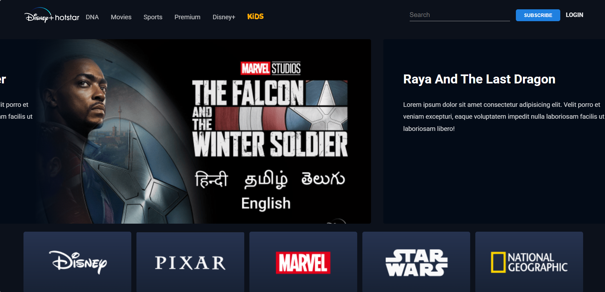

 
  
Architecture

  
  
Home page

# 🚀 3-Tier Architecture Application Deployment on AWS

## 📌 Project Overview

This project demonstrates a production-ready 3-Tier Architecture deployment on AWS using:

- Custom VPC (192.168.0.0/16)
- Public & Private Subnets
- EC2 (Web & App Tier)
- RDS MySQL (Database Tier)
- Internal & External Load Balancers
- Auto Scaling Groups
- ACM (HTTPS)
- Route53 (Custom Domain)
- CloudFront (CDN)
- S3 (Private Code Storage)
- IAM Roles & SSM Access

---

# 🏗 Architecture Layers

## 1️⃣ Web Tier
- EC2 Instances (Public Subnet)
- Nginx
- External Application Load Balancer
- Auto Scaling Group
- HTTPS via ACM

## 2️⃣ Application Tier
- EC2 Instances (Private Subnet)
- Node.js Application (Port 4000)
- Internal Application Load Balancer
- Auto Scaling Group
- Connected to RDS

## 3️⃣ Database Tier
- Amazon RDS MySQL
- Private Subnets
- Dedicated Security Group

---

# ⚙️ Deployment Steps (High Level)

### Step 1 – Create VPC
- CIDR: 192.168.0.0/16
- 2 Public Subnets
- 4 Private Subnets
- 1 NAT Gateway
- Internet Gateway

### Step 2 – Create Security Groups
- Web ALB SG
- Web Server SG
- App Internal ALB SG
- App Server SG
- Database SG

### Step 3 – Create Private S3 Bucket
- Store application code
- Upload App-tier & Web-tier files

### Step 4 – Create IAM Role
- Trusted Entity: EC2
- Permissions: SSM Access
- Attach role to EC2 instances

### Step 5 – Create RDS (MySQL)
- Private Subnet Group
- No public access
- Allow access from App-SG only
- Update DB credentials in App config

### Step 6 – Deploy Application Tier
- Launch EC2 in Private Subnet
- Install Node.js & PM2
- Download code from S3
- Start application on port 4000
- Create Internal ALB with health check `/health`

### Step 7 – Deploy Web Tier
- Launch EC2 in Public Subnet
- Install Node.js & Nginx
- Configure nginx to route `/api` to Internal ALB
- Create External ALB (Internet-facing)

### Step 8 – Configure HTTPS
- Request certificate via ACM
- Attach certificate to External ALB (HTTPS listener)

### Step 9 – Configure Auto Scaling
- Create AMIs for Web & App
- Create Launch Templates
- Create ASG (Min: 2, Max: 6, CPU: 70%)
- Attach to respective Load Balancers

### Step 10 – Configure Route53
- Map custom domain to External ALB

### Step 11 – Implement CloudFront
- Configure CDN in front of External ALB
- Improve performance & caching

---

# 🔐 Security Implementation

- Private subnets for App & DB
- RDS not publicly accessible
- Security group restricted communication
- IAM Role with SSM instead of Bastion Host
- HTTPS using ACM
- Layered architecture isolation

---

# 🌍 Final Flow

User → CloudFront → External ALB → Web Server  
Web Server → Internal ALB → App Server  
App Server → RDS MySQL  

---

# 📈 Features Implemented

- High Availability (Multi-AZ)
- Auto Scaling
- HTTPS Encryption
- Internal Service Communication
- Production-grade 3-Tier Design
- CDN Integration
